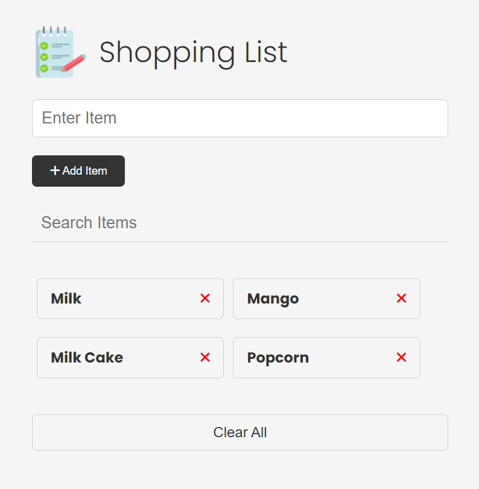

# Shopping List Project

A simple shopping list application built with vanilla JavaScript. This project allows users to manage a list of grocery items by adding, editing, removing, and searching items. The app persists data using `localStorage`, making the list available even after closing or refreshing the browser.

## Screenshot



## Features

1. **Add Grocery Item**: Add items to the shopping list by entering the item name.
2. **Edit Grocery Item**: Modify existing items in the list.
3. **Remove Grocery Item**: Remove an individual item from the list.
4. **Clear All Items**: Clear all the items from the list at once.
5. **Search Items**: Filter items in the list based on search input.
6. **LocalStorage Support**: Persists the shopping list in the browser’s `localStorage`.

## Getting Started

To run the project locally:

1. Clone the repository:
   ```bash
   git clone https://github.com/mdzama1012/shopping-list-vanilla-javascript.git
   cd shopping-list
   ```
